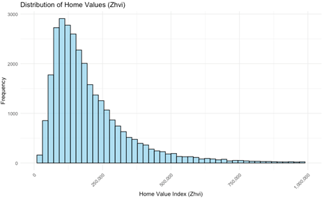
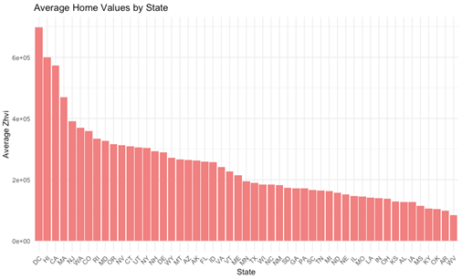
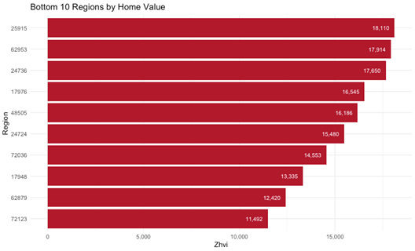
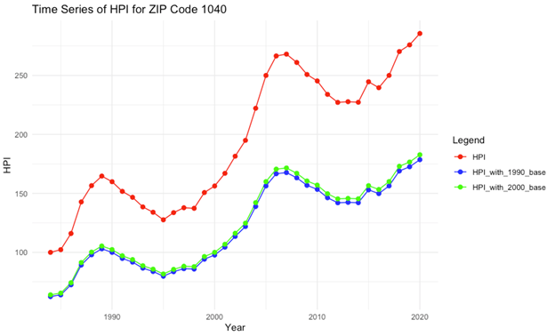

# R-Project 4: Big Data Housing Market Analysis with Spark (R + sparklyr)

This project uses **Apache Spark (sparklyr)** to analyze two large U.S. housing datasets:  
**Zillow Home Value Index (ZHVI)** and the **Annual House Price Index (HPI)**.  
The analysis explores **state-level home values**, **top/bottom ZIP codes**, and **multi-decade price trends** using Spark for distributed data handling.

* **Datasets:**  
  - Zillow Home Value Index (ZHVI)  
  - FHFA Annual House Price Index (ZIP5)  
* **Tools:** R, sparklyr, dplyr, ggplot2, FHFA/Zillow datasets  
* **Techniques:** Spark SQL, distributed filtering/aggregation, histograms, bar charts, time-series plotting  
* **Goal:** Understand geographic differences in home values and long-term real estate trends using big data tools.

---

## 📁 Dataset Overview

Two datasets were analyzed:

### ✔ **1. ZHVI — Zillow Home Value Index**  
Contains typical home values across all U.S. ZIP codes.

### ✔ **2. Annual House Price Index (HPI)**  
Historical housing appreciation for each ZIP code since the 1990s, normalized to 1990 and 2000 bases.

Spark was used to load, process, filter, and aggregate millions of records.

---

## 🧹 Data Processing with Spark

Using **sparklyr**, the workflow included:

✔ Connecting to a local Spark session  
✔ Loading ZHVI & HPI CSV files into Spark clusters  
✔ Removing unnecessary columns  
✔ Spark SQL for filtering, grouping, aggregating  
✔ Converting results to R for visualization  

---

# 📊 Part 1 — ZHVI Housing Value Analysis

## 📈 1. Distribution of Home Values (Figure 1)

The ZHVI distribution is **strongly right-skewed**, with most homes priced below **$250k**  
and a long tail extending to above **$1M**.

  
  
<em>Figure 1. ZHVI distribution (0–1,000,000 range).</em>

✔ Most properties fall between **$200k–$250k**  
✔ Very expensive properties (> $750k) are rare  
✔ High-value ZIP codes heavily shift the upper tail  

---

## 📊 2. Average Home Values by State (Figure 2)

  
  
<em>Figure 2. Average ZHVI by U.S. state.</em>

### Key Findings  
- **Highest states:**  
  🥇 District of Columbia (DC)  
  🥈 Hawaii (HI)  
  🥉 California (CA)  

- **Lowest states:** Mississippi (MS), Alabama (AL), West Virginia (WV)

➡ High-demand coastal states show dramatically higher home values.

---

## 🏆 3. Top 10 & Bottom 10 ZIP Codes (Figures 3 & 4)

### Top 10 ZIP Codes by Home Value  

  
  
<em>Figure 3. Top 10 regions by home value.</em>

- ZIP **94027** (~$6.6M) is the highest in the entire dataset  
- Indicates extremely high-end real estate markets (Silicon Valley, luxury areas)  

### Bottom 10 ZIP Codes by Home Value  

  
  
<em>Figure 4. Bottom 10 regions by home value.</em>

- Lowest ZIP code: **72123** (~$11k)  
- Rural or economically distressed areas dominate the bottom tier  

➡ Demonstrates **extreme inequality** in U.S. housing markets.

---

# 📈 Part 2 — HPI Time Series Analysis (ZIP Code 1040)

Spark was used to filter and extract HPI rows for ZIP code **1040**.  
Three time series were plotted:

- **Raw HPI**  
- **HPI normalized to 1990**  
- **HPI normalized to 2000**

  
  
<em>Figure 5. Five-digit ZIP code 1040 — HPI trend over time.</em>

### Key Observations  
✔ Home prices grew strongly from 1990 → 2007  
✔ Prices dropped significantly during the **2008 financial crisis**  
✔ Sharp rebound after 2012  
✔ Continued growth toward 2020  

Normalizing to 1990/2000 makes the long-term appreciation clearer.

---

# 🧠 Insights & Interpretation

### 🏡 **ZHVI Dataset Insights**
- Most U.S. ZIP codes have home values below **$500k**  
- High-value homes are concentrated in a few regions  
- DC, HI, and CA dominate housing value rankings  
- Rural states show much more affordable housing  

### 📬 **Top/Bottom ZIP Codes**
- ZIP **94027** stands out as an extreme luxury outlier  
- Bottom ZIP codes suggest low-demand, low-income regions  

### 📈 **HPI Time-Series Insights**
- U.S. home prices show **long-term upward trends**  
- 2008 crash clearly visible, but recovery was strong  
- Useful for investors, policymakers, and economic modeling  

---

# 🧠 Skills Demonstrated

- Spark connection & distributed data processing  
- Data transformation using dplyr + sparklyr  
- Big data EDA workflows  
- ggplot2 visualization of Spark-managed data  
- Time series interpretation (HPI trends)  
- Analysis of geographic housing market inequality  

